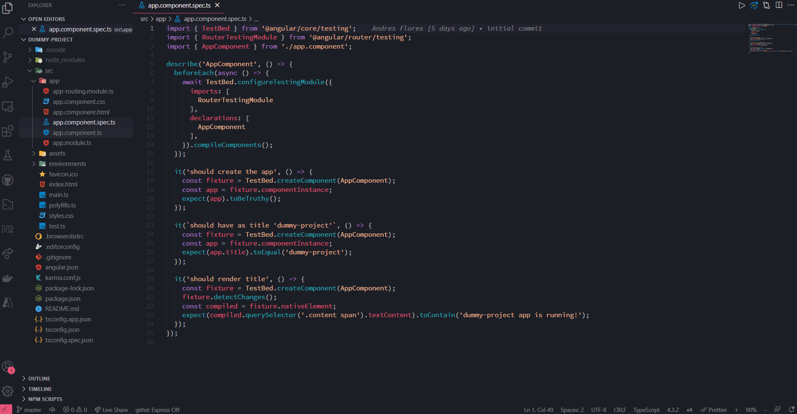
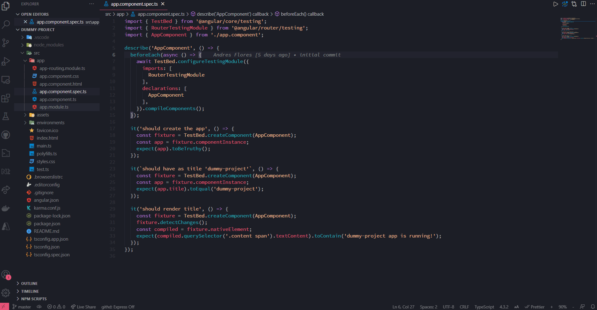

# Jasmine/Karma Single File Runner README

Or JSFR for short. This extension gives you the ability to provide a single file for testing to the Angular test suite.

## Features

Execute tests by simply right-clicking anywhere in a `.spec.ts` file and selecting the option `JSFR: Test Current File`:

Or by right-cliking on the `.spec.ts` file in the file explorer:

## Requirements

Must have VS Code version 1.57.0 or higher.

Must have VS Code open in an angular project (contains an `angular.json` file).

## Known Issues

Changes made to the `test.ts` file while JSFR is running won't be kept, as `test.ts` is reverted to its initial state before starting JSFR.

---

## Releases

See the [changelog](CHANGELOG.md).